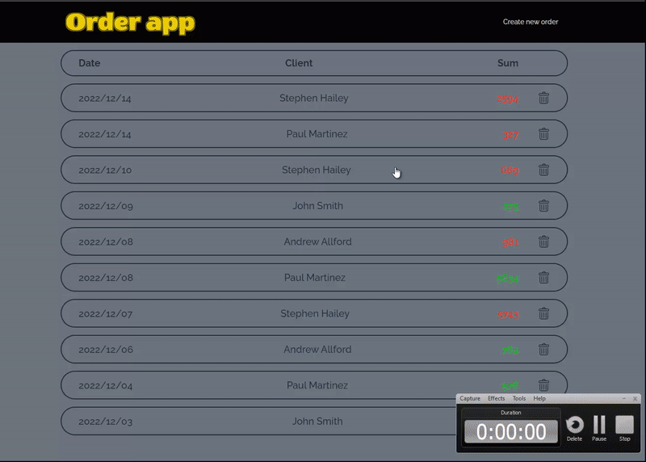

**[Demo](http://84.38.180.229/)**

### Задание

- Язык - PHP
- База данных – MySQL

1. Создать базу данных заказов и наполнить ее тестовыми данными
2. Сделать простой интерфейс (дизайн и верстка не важны) для работы с этими данными.

У заказа есть общая стоимость, описание заказа в свободной форме, контактные данные.

Необходимо сделать простой интерфейс просмотра списка заказов.

Из списка можно провалиться в конкретный заказ и увидеть всю информацию по заказу. 

Внутри заказа можно провалиться в покупателя и увидеть информацию по нему, список его заказов с возможностью провалиться (откроется та же страница, что из списка заказов), общие суммы по заказам: всего, оплачено, не оплачено.

На странице списка заказов есть форма добавления заказа. После добавления заказа через форму он также появляется в списке и в него можно провалиться.

Будет плюсом:
1. Использовать ООП
2. Использовать AJAX

### Реализовано:

- Просмотр списка заказов

- Переход в заказ из списка

- Переход на страницу клиента из заказа

- Переход на страницу статистики по клиенту со страницы клиента

- Создание заказа (заказ появляется в списке без перезагрузки страницы и в него можно перейти)

- Валидация полей формы заказа

- Удаление заказа (заказ исчезает из списка без перезагрузки страницы)

- Адаптивная верстка

### Используемые технологии:

- PHP

- jQuery

- AJAX

### Запуск проекта

```
index.php
```
Перед запуском приложения необходимо создать базу данных MySQL с именем **orders**, пользователем **root** и паролем **1** и загрузить в нее данные из файла **dump.sql**